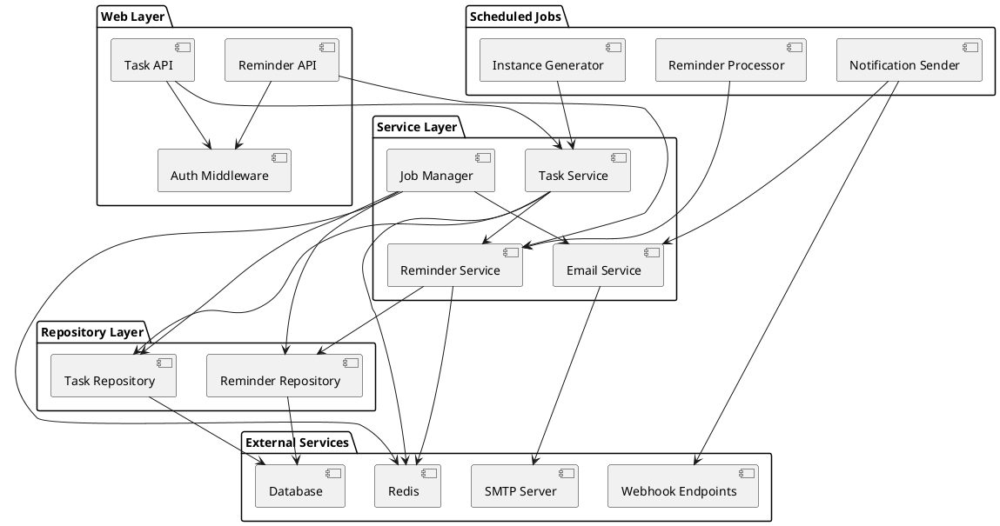
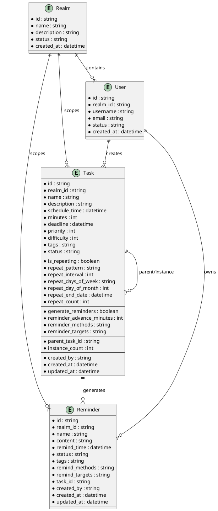
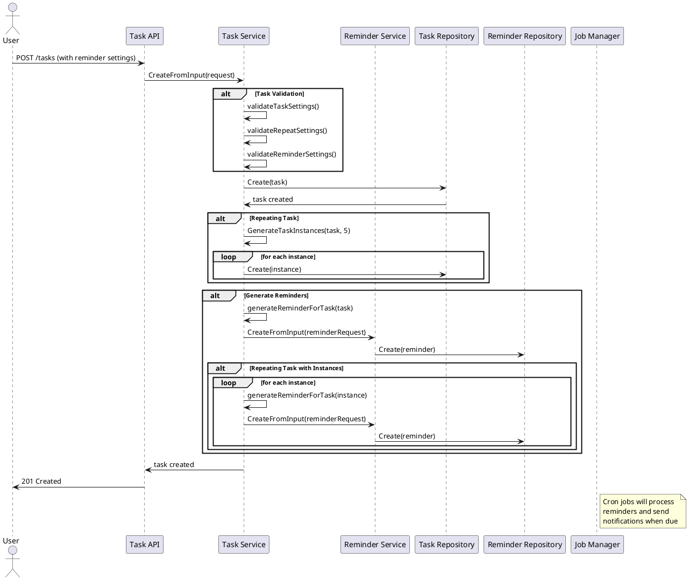
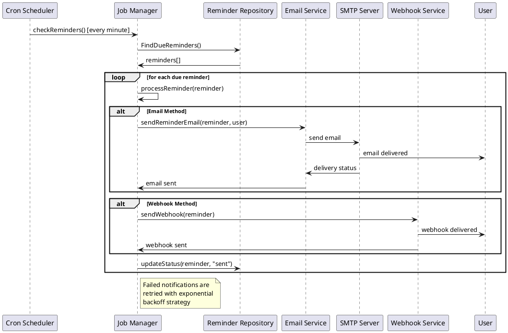
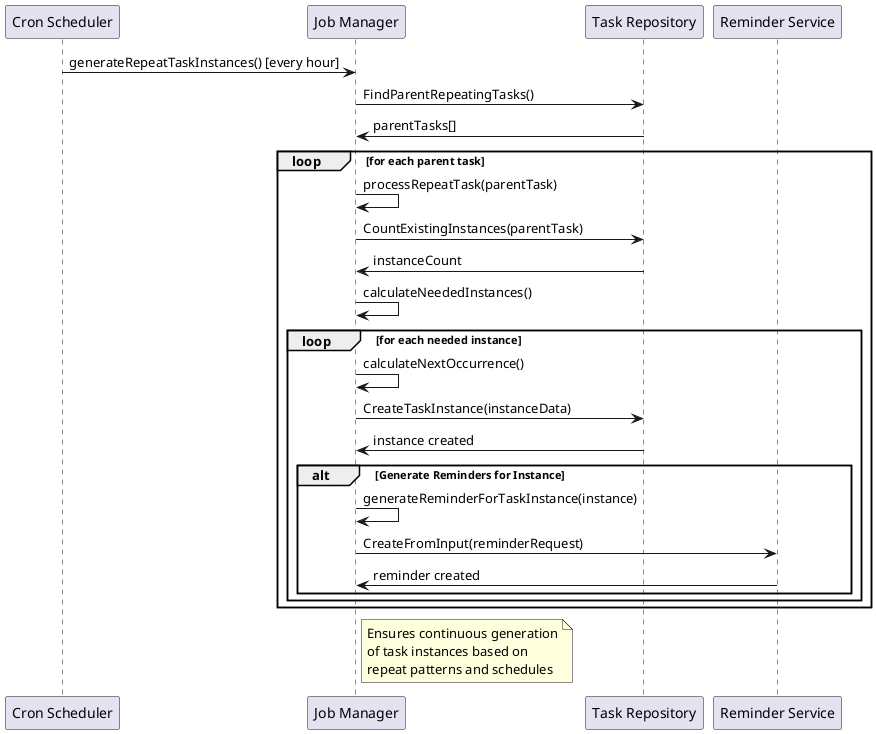

# Task Reminding System Design

## Overview

The Task Reminding System is a comprehensive feature that enables users to create tasks with automated reminder notifications. It supports both one-time and repeating tasks with flexible reminder settings, multiple notification channels, and advanced scheduling patterns.

## Business Requirements

### Functional Requirements

1. **Task Creation with Reminders**
   - Users can create tasks with optional reminder generation
   - Support for advance notification timing (minutes before task)
   - Multiple notification methods (email, webhook)
   - Flexible target configuration

2. **Repeating Task Support**
   - Daily, weekly, monthly, and yearly repeat patterns
   - Customizable repeat intervals
   - Specific day selection for weekly patterns
   - End date or count-based termination
   - Automatic instance generation

3. **Reminder Management**
   - Automatic reminder creation based on task settings
   - Rich content formatting with task details
   - Tag-based organization
   - Status tracking (pending, sent, failed)

4. **Notification Delivery**
   - Email notifications with formatted content
   - Webhook notifications for integration
   - Retry mechanism for failed deliveries
   - Delivery status tracking

### Non-Functional Requirements

1. **Performance**
   - Support for thousands of concurrent tasks
   - Efficient cron job processing
   - Minimal latency for reminder delivery
   - Scalable instance generation

2. **Reliability**
   - Guaranteed reminder delivery
   - Fault tolerance for service outages
   - Data consistency across operations
   - Recovery from system failures

3. **Security**
   - User authentication and authorization
   - Secure webhook endpoints
   - Data encryption for sensitive information
   - Audit logging for all operations

## Use Case Diagram

```plantuml
@startuml Task Reminding Use Cases

!define RECTANGLE class

actor "User" as user
actor "System Administrator" as admin
actor "Cron Job Scheduler" as cron
actor "Email Service" as email
actor "Webhook Service" as webhook

rectangle "Task Reminding System" {

  ' Core Task Management
  usecase "Create Task" as UC1
  usecase "Create Repeating Task" as UC2
  usecase "Configure Reminders" as UC3
  usecase "Update Task" as UC4
  usecase "Delete Task" as UC5
  usecase "View Tasks" as UC6

  ' Reminder Management
  usecase "Generate Reminders" as UC7
  usecase "Schedule Reminders" as UC8
  usecase "View Reminders" as UC9
  usecase "Cancel Reminders" as UC10
  
  ' Instance Management
  usecase "Generate Task Instances" as UC11
  usecase "Manage Instance Lifecycle" as UC12
  usecase "Track Instance Progress" as UC13
  
  ' Notification Delivery
  usecase "Send Email Notifications" as UC14
  usecase "Send Webhook Notifications" as UC15
  usecase "Retry Failed Notifications" as UC16
  usecase "Track Delivery Status" as UC17
  
  ' System Operations
  usecase "Process Scheduled Jobs" as UC18
  usecase "Monitor System Health" as UC19
  usecase "Manage Configuration" as UC20
  usecase "Generate Reports" as UC21

  ' Validation and Error Handling
  usecase "Validate Task Settings" as UC22
  usecase "Handle Service Errors" as UC23
  usecase "Log System Events" as UC24
}

' User interactions
user --> UC1 : Creates new task
user --> UC2 : Creates repeating task
user --> UC3 : Configures reminder settings
user --> UC4 : Updates existing task
user --> UC5 : Deletes task
user --> UC6 : Views task list
user --> UC9 : Views reminders
user --> UC10 : Cancels reminders

' System Administrator interactions
admin --> UC19 : Monitors system
admin --> UC20 : Manages configuration
admin --> UC21 : Generates reports
admin --> UC24 : Reviews logs

' Cron Job Scheduler interactions
cron --> UC18 : Triggers scheduled jobs
cron --> UC11 : Generates instances
cron --> UC7 : Generates reminders
cron --> UC14 : Sends email notifications
cron --> UC15 : Sends webhook notifications

' External Service interactions
email --> UC14 : Delivers email
webhook --> UC15 : Delivers webhook

' System relationships
UC1 ..> UC22 : validates
UC2 ..> UC22 : validates
UC3 ..> UC22 : validates
UC1 ..> UC7 : triggers
UC2 ..> UC7 : triggers
UC2 ..> UC11 : triggers
UC7 ..> UC8 : schedules
UC8 ..> UC14 : sends email
UC8 ..> UC15 : sends webhook
UC14 ..> UC16 : on failure
UC15 ..> UC16 : on failure
UC14 ..> UC17 : tracks status
UC15 ..> UC17 : tracks status
UC18 ..> UC23 : handles errors
UC23 ..> UC24 : logs events

' Extension relationships
UC2 --> UC11 : <<extend>>
UC1 --> UC7 : <<extend>>
UC7 --> UC8 : <<include>>
UC8 --> UC17 : <<include>>
UC14 --> UC16 : <<extend>>
UC15 --> UC16 : <<extend>>

note right of UC1
  Basic task creation with
  optional reminder settings
end note

note right of UC2
  Repeating tasks with
  pattern configuration
  and instance generation
end note

note right of UC7
  Automatic reminder creation
  based on task settings
  and advance timing
end note

note right of UC18
  Scheduled processing of:
  - Instance generation
  - Reminder delivery
  - Status updates
end note

@enduml
```



## System Architecture

### Component Overview



### Data Model



## Sequence Diagrams

### Task Creation with Reminders



### Reminder Processing and Notification



### Instance Generation for Repeating Tasks



## Implementation Details

### Core Components

#### 1. Task Service (`internal/task/task_service.go`)

**Responsibilities:**
- Task CRUD operations
- Repeat pattern validation
- Instance generation
- Reminder integration

**Key Methods:**
```go
func (s *TaskService) CreateFromInput(req CreateTaskRequest) (*models.Task, error)
func (s *TaskService) GenerateTaskInstances(parentTask *models.Task, maxInstances int) ([]*models.Task, error)
func (s *TaskService) generateReminderForTask(task *models.Task) error
func (s *TaskService) validateRepeatSettings(req CreateTaskRequest) error
```

#### 2. Reminder Service (`internal/reminder/reminder_service.go`)

**Responsibilities:**
- Reminder CRUD operations
- Content formatting
- Notification method validation

**Key Methods:**
```go
func (s *ReminderService) CreateFromInput(req CreateReminderRequest) (*models.Reminder, error)
func (s *ReminderService) FindDueReminders(beforeTime time.Time) ([]*models.Reminder, error)
func (s *ReminderService) UpdateStatus(id string, status string) error
```

#### 3. Job Manager (`internal/service/job_manager.go`)

**Responsibilities:**
- Cron job scheduling
- Reminder processing
- Notification delivery
- Instance generation

**Key Methods:**
```go
func (jm *JobManager) checkReminders()
func (jm *JobManager) generateRepeatTaskInstances()
func (jm *JobManager) processReminder(reminder *Reminder) error
func (jm *JobManager) sendReminderEmail(reminder *Reminder, user *User) error
```

### Data Structures

#### Task Model
```go
type Task struct {
    // Basic fields
    ID           string    `gorm:"primaryKey"`
    RealmID      string    `gorm:"index"`
    Name         string    `gorm:"not null"`
    Description  string
    ScheduleTime time.Time `gorm:"index"`
    
    // Repeat settings
    IsRepeating       bool
    RepeatPattern     string // daily, weekly, monthly, yearly
    RepeatInterval    int
    RepeatDaysOfWeek  string // comma-separated: mon,wed,fri
    RepeatDayOfMonth  int
    RepeatEndDate     *time.Time
    RepeatCount       int
    
    // Reminder settings
    GenerateReminders      bool
    ReminderAdvanceMinutes int
    ReminderMethods        string // comma-separated: email,webhook
    ReminderTargets        string // comma-separated targets
    
    // Instance tracking
    ParentTaskID   *string
    InstanceCount  int
}
```

#### Reminder Model
```go
type Reminder struct {
    ID            string    `gorm:"primaryKey"`
    RealmID       string    `gorm:"index"`
    Name          string    `gorm:"not null"`
    Content       string    `gorm:"type:text"`
    RemindTime    time.Time `gorm:"index"`
    Status        string    `gorm:"default:'pending'"`
    Tags          string
    RemindMethods string    // email,webhook
    RemindTargets string    // target addresses/URLs
    TaskID        *string   `gorm:"index"`
}
```

### Repeat Patterns

#### Pattern Types
1. **Daily**: Every N days
2. **Weekly**: Every N weeks on specific days
3. **Monthly**: Every N months on specific day
4. **Yearly**: Every N years on specific date

#### Implementation
```go
func (t *Task) GetNextOccurrence(fromDate time.Time) time.Time {
    switch t.RepeatPattern {
    case "daily":
        return fromDate.AddDate(0, 0, t.RepeatInterval)
    case "weekly":
        return t.getNextWeeklyOccurrence(fromDate)
    case "monthly":
        return t.getNextMonthlyOccurrence(fromDate)
    case "yearly":
        return fromDate.AddDate(t.RepeatInterval, 0, 0)
    }
    return fromDate
}
```

### Notification Methods

#### Email Notifications
- **Format**: HTML with rich formatting
- **Content**: Task details, timing, priority
- **Delivery**: SMTP integration
- **Retry**: Exponential backoff

#### Webhook Notifications
- **Format**: JSON payload
- **Content**: Structured task data
- **Delivery**: HTTP POST
- **Security**: Optional authentication

### Cron Job Schedule

1. **Reminder Processing**: Every minute
   - Find due reminders
   - Send notifications
   - Update status

2. **Instance Generation**: Every hour
   - Find parent repeating tasks
   - Generate missing instances
   - Create associated reminders

## Error Handling

### Validation Errors
- Invalid repeat patterns
- Negative advance times
- Invalid notification methods
- Missing required fields

### Runtime Errors
- Service unavailability
- Network failures
- Database errors
- Email delivery failures

### Recovery Strategies
- Retry mechanisms
- Graceful degradation
- Error logging
- Status tracking

## Performance Considerations

### Database Optimization
- Proper indexing on time fields
- Batch operations for instances
- Connection pooling
- Query optimization

### Cron Job Efficiency
- Limit processing batches
- Avoid overlapping executions
- Resource monitoring
- Error rate tracking

### Memory Management
- Streaming large datasets
- Garbage collection tuning
- Connection limits
- Cache strategies

## Security Considerations

### Authentication & Authorization
- User realm isolation
- API authentication
- Permission validation
- Audit logging

### Data Protection
- Sensitive data masking
- Encryption at rest
- Secure communications
- Access controls

### Webhook Security
- URL validation
- Authentication headers
- Rate limiting
- Payload verification

## Monitoring & Observability

### Metrics
- Task creation rate
- Reminder delivery success
- Instance generation count
- Error rates

### Logging
- Structured logging
- Error tracking
- Performance metrics
- User activity

### Alerting
- Failed deliveries
- System errors
- Performance degradation
- Resource exhaustion

## Testing Strategy

### Unit Tests
- Service method testing
- Validation logic
- Helper functions
- Error scenarios

### Integration Tests
- Database operations
- Service interactions
- API endpoints
- External services

### BDD Tests
- User scenarios
- Business workflows
- Edge cases
- Error handling

### Performance Tests
- Load testing
- Stress testing
- Scalability testing
- Resource monitoring

## Deployment Considerations

### Environment Configuration
- Database connections
- Email settings
- Webhook configurations
- Cron schedules

### Scaling Strategies
- Horizontal scaling
- Database sharding
- Queue processing
- Load balancing

### Monitoring Setup
- Health checks
- Metrics collection
- Log aggregation
- Alert configuration

## Future Enhancements

### Advanced Features
1. **Smart Scheduling**
   - AI-powered timing optimization
   - User behavior analysis
   - Adaptive reminder timing

2. **Enhanced Notifications**
   - SMS notifications
   - Push notifications
   - Slack/Teams integration
   - Custom templates

3. **Analytics & Insights**
   - Task completion rates
   - Reminder effectiveness
   - User engagement metrics
   - Performance analytics

4. **Advanced Patterns**
   - Custom repeat patterns
   - Holiday awareness
   - Timezone support
   - Business day scheduling

### Technical Improvements
1. **Performance Optimization**
   - Caching strategies
   - Database optimization
   - Async processing
   - Resource pooling

2. **Reliability Enhancements**
   - Circuit breakers
   - Retry strategies
   - Failover mechanisms
   - Data consistency

3. **Developer Experience**
   - API documentation
   - SDK development
   - Testing utilities
   - Development tools

## Conclusion

The Task Reminding System provides a robust, scalable solution for automated task notifications with comprehensive repeat patterns and flexible delivery methods. The architecture supports both simple use cases and complex business requirements while maintaining high performance and reliability standards.

The system's modular design allows for easy extension and maintenance, while the comprehensive testing strategy ensures reliability and correctness. The BDD approach provides living documentation that bridges the gap between business requirements and technical implementation.
